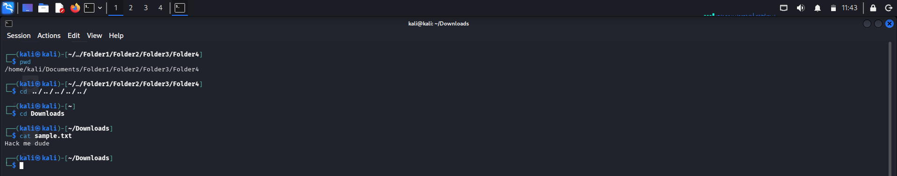
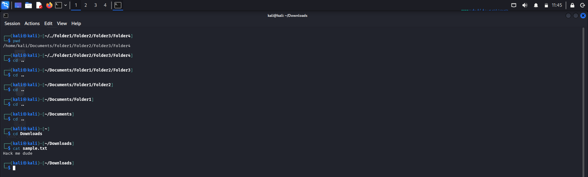
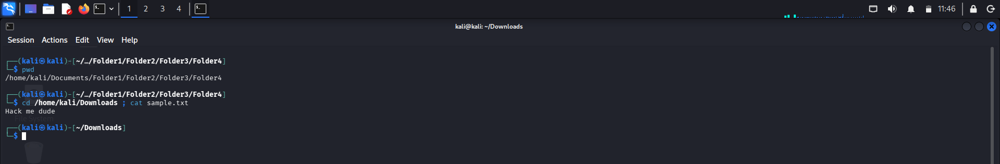
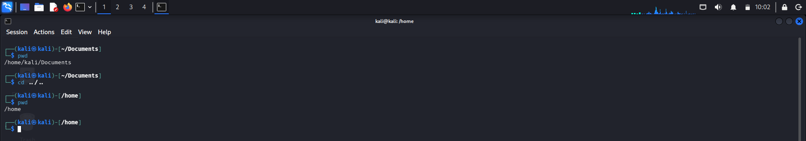
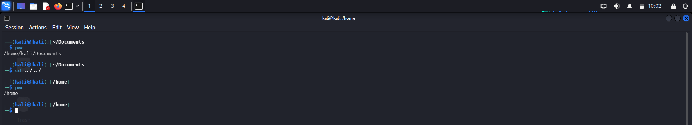
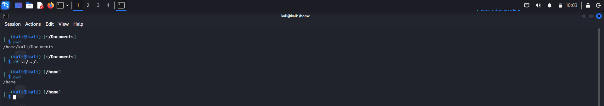

# Log: Absolute Path vs Relative Path

## What I Learned

Absolute path always starts with `/`. It gives the exact, unique location of something, no matter where you currently are in the filesystem.

Relative path doesn't start with `/`. It's based on wherever your current directory happens to be, and it describes how to get somewhere from there, either into subdirectories or back up toward parent ones using `..`.

## Three Ways I Tested Getting From Folder4 to Downloads

Starting point: `/home/kali/Documents/Folder1/Folder2/Folder3/Folder4`. Goal: get to `~/Downloads` and read `sample.txt`.

### Method 1: One combined relative jump

    cd ../../../../..
    cd Downloads
    cat sample.txt

Works, still two commands though.

### Method 2: One `cd ..` at a time

    cd ..
    cd ..
    cd ..
    cd ..
    cd ..
    cd Downloads
    cat sample.txt

Slowest of the three by far. I could watch myself climb each level, which was oddly satisfying but not practical.

### Method 3: Absolute path, one line

    cd /home/kali/Downloads ; cat sample.txt

This won, no contest. Doesn't matter how deep I am, I jump straight there.

Seeing all three side by side made something click that just reading about it didn't: relative paths are fine for short hops nearby, but the moment the distance is large, absolute wins on speed every time.

## Relative Path — Going Forward

At `/home`, wanting to reach `/home/kali/downloads/x/y/z`. No need to repeat `/home`, just write what comes after:

    kali/downloads/x/y/z

## Relative Path — Going Backward

Folder names only point forward. Going backward needs `..`, one per level.

At `z` (`/home/kali/downloads/x/y/z`), wanting to get back to `/home`. Counted it out: `z → y → x → downloads → kali → home`, five levels:

    cd ../../../../..

## Same Destination, Three Ways to Write It

Tested this from `/home/kali/Documents`, trying to get back to `/home`. All three of these landed me in the same place:

**1. `cd ../..`**

**2. `cd ../../`**

**3. `cd ../../.`**

All three work identically. The trailing `/` at the end doesn't change anything, and the extra `.` at the end just means "current directory," which after the `..`s have already moved you, is wherever you've landed, so it's a no-op. Good to know these aren't three different behaviors, just three ways of writing the same instruction.

## Combining `..` With Folder Names

Didn't know this was even a thing until now, `..` and regular folder names in the same command, moving backward then forward.

At `/var/log`, need `/var/www/html`. Back one (`log` to `var`), then forward:

    cd ../www/html

## The Root Mistake

This one got me. I forgot `/` itself counts as a level when counting `..`s. It's not a named folder like the rest, so it's easy to just skip over mentally.

Tried going from `/home/kali/Downloads` to `/etc`:

    cd ../../etc   # wrong, only crosses two levels, never reaches root

Got "no such file or directory." Needed one more:

    cd ../../../etc

`Downloads → kali → home → /` is three levels. `etc` sits right under root.

## Portability

An absolute path like `/home/kali/Documents/sample.txt` only works on my machine. Hand it to a friend with a different username and it's broken instantly.

`Documents/sample.txt` is portable, but pointed out something I hadn't thought of, it can still go wrong if their current directory isn't what you assumed, especially if they've got more than one `Documents` folder floating around.

`~/Documents/sample.txt` ended up being the best of both, portable across users since `~` always means "your home directory," but without the ambiguity of a plain relative path.

## My Learning Journey / Struggle

First quiz: 50%, below the cutoff. Where I went wrong:

Got completely stuck combining `..` with folder names in one path. Had genuinely never seen that before, only ever used them as separate commands.

Thought `pwd` would show `~` in its output. It never does, it always prints the full absolute path.

Assumed dropping the leading `/` from a path automatically made it "relative," without realizing relative paths depend on where you actually are, not just missing a slash.

Got a 3-task practical set after that. Navigated `/home` to `/home/kali/Downloads`, correct on the first try. Then `~/Downloads` to `/etc`, first attempt failed from forgetting root counts as a level, fixed it to `../../../etc`. Then `/etc` to `/home/kali/Documents`, applied the root lesson properly this time, no mistakes.

Retook the quiz after: 3 out of 4, right at the cutoff. The one miss was a syntax slip, an extra trailing slash, not a real misunderstanding.

Also ran the three-method comparison above, which made the time difference between relative and absolute paths obvious instead of just something I'd read about. Later tested three slightly different ways of writing the same `..` path and confirmed a trailing slash or a trailing dot don't actually change anything.

## Confidence Check

Feel solid on the core absolute vs relative distinction, jumping anywhere with absolute paths, building relative paths forward, and combining `..` with folder names, that last one was the real unlock this session. Also solid now on trailing slashes and dots being cosmetic, not functional.

Root counting still trips me up occasionally on the first try, gets it right eventually but not automatic yet.

## Next

- More reps on `..` plus folder name combos until root-counting stops needing conscious effort
- Look into `cd -` for jumping back to the previous directory

---

## Notes

**Absolute path:** always starts with `/`, points to one exact location no matter where you are. Best for anything that needs to work regardless of current directory, but breaks across machines with different usernames or structures.

**Relative path:** never starts with `/`, always based on current directory. Folder names go forward, `..` goes backward, one per level. Both can combine in the same path.

**The root trap:** `/` itself is a level. Forgetting to count it is the single most common mistake here.

**Trailing characters don't matter:** `cd ../..`, `cd ../../`, and `cd ../../.` all do the exact same thing. Trailing `/` is cosmetic, and a trailing `.` just means "stay right here," which after the `..`s applies, is wherever you've already arrived.

**`pwd` always returns the absolute path.** Never relative, never `~`.

| Path type | Portable? | Risk |
|---|---|---|
| Absolute | No | Breaks with different username/structure |
| Relative | Yes | Ambiguous if current directory isn't what you expect |
| `~` | Yes | Reliable, always resolves to current user's home |
