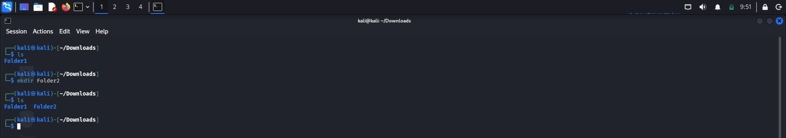
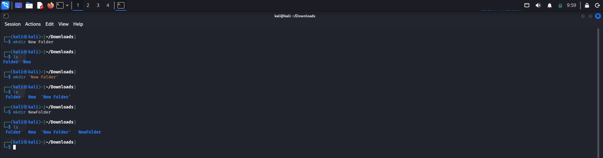
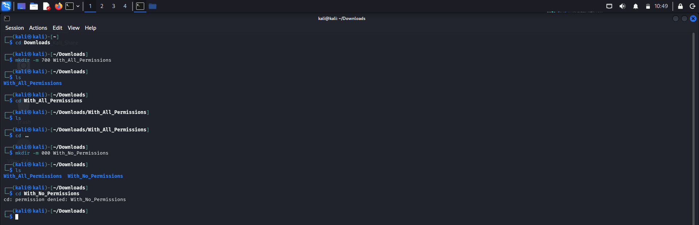

# Log: mkdir and its Flags (-p, -v, -m) and Naming Mistakes

## What I Learned

`mkdir` makes directories. Probably short for "make directory."

    mkdir directory_name

## Space in Directory Names

Tested this myself:

- `mkdir New Folder` makes two directories, `New` and `Folder`. The space splits it into two arguments.
- `mkdir 'New Folder'` makes one directory called `New Folder`, quotes force it into one argument.
- `mkdir NewFolder` just works, no space to worry about.

## Multiple Directories at Once

    mkdir Test1 Test2 Test3

Three separate directories. Same rule, unquoted spaces split arguments no matter what.

## Flags: -p and -v

`-p` builds nested folders in one shot and skips any parent that already exists instead of erroring out. `-v` prints a line for each folder it actually creates.

    mkdir -pv Folder1/Folder2/Folder3/Folder4

First run: four confirmation lines, one each for `Folder1`, `Folder1/Folder2`, `Folder1/Folder2/Folder3`, and `Folder1/Folder2/Folder3/Folder4`. Ran it again right after, got nothing. Not an error, just silence, since everything already existed and `-p` skips quietly.
## Flag: -m (Permissions)

`-m` sets permissions at creation time.

    mkdir -m [3-digit permission] my_folder

Each digit adds up:

- Read (r) = 4
- Write (w) = 2
- Execute (x) = 1

Order is always owner, group, others.

Made `sharedfolder` with `mkdir -m 644 sharedfolder`, checked with `ls -l`:

    drw-r--r-- 2 kali kali 4096 ... sharedfolder

Group and others get read only, no execute. Tried `cd sharedfolder`, permission denied. This is the bit that took me a while: read lets you list contents, it does nothing for entering the folder. Execute handles that, on its own.

Also made `testfolder` with `mkdir -m 511 testfolder` and tried `touch test.txt` inside. Denied. Read plus execute gets you in and lets you look, but no write means no creating or deleting anything, even as the owner.

## My Learning Journey / Struggle

First quiz on this went badly, around 45%. What I got wrong:

Thought `mkdir Test1 Test2 Test3` without quotes would make one folder, forgetting the space rule I'd literally just tested a minute earlier.

Kept saying "no write permission" when explaining why `cd` fails on 644. It's execute, not write, and I confused the two more than once.

I'd also picked up somewhere (Gemini) that `-v` needs `-p` to work. Never tested it myself, turned out to be wrong. Lesson there about verifying instead of trusting what I read.

Assumed rerunning `mkdir` on an existing folder gives a success message, it's actually an error, "File exists." And I miscounted how many lines `-p -v` prints when part of a path already exists, thought it was one per folder regardless, it's only for the ones actually created.

Got handed five practical tasks after that: multiple directories, rerunning `-pv`, testing 644 and 511 for real. All five came out right with actual terminal output. Quiz after that: 5/5, including reasoning through 750 on my own (owner full, group view and enter only, others nothing).

## Confidence Check

Feel solid on basic `mkdir` usage, naming with spaces and quotes, `-p` and `-v` behavior (together and alone), and calculating permission digits.

The read vs execute distinction for directories was genuinely the hard part, mixed it up constantly at first, but it's stuck now after actually breaking things on purpose.

Still haven't tested any of this as a non-owner user, only ever as myself. Want to fix that next.

## Next

- Make a second Linux user, test directory access from their side
- Look into `chmod` for changing permissions after creation instead of only at `mkdir` time

---

## Notes

**Permission digits:**

| Digit | Permission | Meaning |
|---|---|---|
| 4 | r (Read) | View directory contents |
| 2 | w (Write) | Create/delete/rename inside |
| 1 | x (Execute) | Enter the directory |

Mnemonic: "View, Edit, Enter"

Read and execute are independent, having one doesn't give you the other. Execute specifically controls whether you can `cd` in.

Order is fixed: owner, group, others.

- `700` → owner full, nobody else gets anything
- `750` → owner full, group can view and enter but not edit, others nothing
- `644` → everyone can view, nobody can enter or edit
- `777` → full access for everyone, which is basically no restriction at all on a shared system
