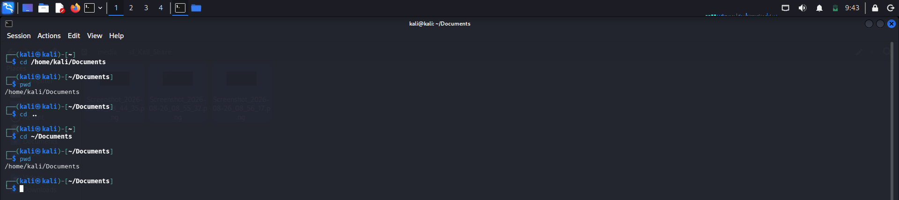

# Log: Understanding ~ (Tilde)

## What I Learned

`~` is a shortcut that represents the **current user's home directory**.

So instead of writing the full path:

    /home/kali/Documents

I can just write:

    ~/Documents

## How I Verified This

Tested it using `cd`:

    cd /home/kali/Documents
    cd ~/Documents

Both commands took me to the same place — confirms `~` = my home directory path.

## Why This Matters (My Own Example)

Thought of a practical case to make sense of this:

Say I run a company with a Linux system that has multiple users — A, B, C, D. If I want to tell all of them to go to their own documents folder, without `~` I'd have to give each person a different, personalized instruction:

    /home/a/documents/folder
    /home/b/documents/folder
    /home/c/documents/folder

Instead, I can just tell all of them the same thing:

    ~/documents/folder

Even though they're different users, this single path works for everyone because `~` automatically maps to *their own* home directory.

## My Understanding (Not Fully Confirmed)

I'm assuming that when a user logs in, `~` resolves to their specific home directory — and this is probably tied to their UID, since each user has their own unique UID and, likely, their own home directory linked to it. Haven't verified this UID connection yet, just a reasonable guess based on what I know so far.

## Confidence Check

**Solid on:**
- What `~` represents and how it saves time
- Verified using `cd` that `~/Documents` and the full path lead to the same place

**Shaky on:**
- Whether `~` is technically tied to UID, or resolved some other way — need to confirm this later

## Next

- Look into how `~` actually gets resolved by the shell (is it UID-based or something else?)
